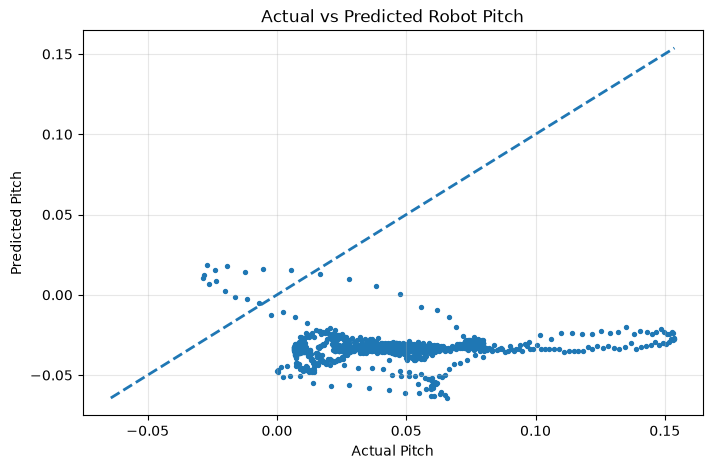

# Wheelbot Statistical Analysis

A statistical analysis project using the **Mini Wheelbot Dataset** to investigate the relationship between **drive-wheel angular velocity** and **robot pitch angle**.


---

## 📌 Project Overview

This project analyzes real robotic sensor data collected from the **Mini Wheelbot**, a self-balancing robotic platform.

The main objective is to investigate whether changes in **drive-wheel angular velocity** are statistically associated with changes in the robot's **pitch angle**.

The project demonstrates a complete beginner-friendly workflow for analyzing robotic sensor data using Python, from data preparation and visualization to statistical modeling and evaluation.

---

## 🎯 Research Question

> **Is drive-wheel angular velocity statistically associated with robot pitch angle?**

This question is investigated using **Simple Linear Regression**.

---

## 📊 Variables

The analysis uses two variables from the Mini Wheelbot Dataset:

| Role                     | Variable             | Description                  |
| ------------------------ | -------------------- | ---------------------------- |
| Independent Variable (X) | `/dq_DR/drive_wheel` | Drive-wheel angular velocity |
| Dependent Variable (Y)   | `/q_yrp/pitch`       | Robot pitch angle            |

The analysis focuses on understanding the statistical relationship between these two robotic measurements.

---

## 📐 Statistical Model

The primary statistical model is **Simple Linear Regression**:

```text
Pitch = Intercept + Coefficient × Drive-Wheel Angular Velocity
```

The model estimates how robot pitch changes in relation to drive-wheel angular velocity.

### Model Purpose

The model is used to:

* Estimate the relationship between the two variables
* Understand the direction of the relationship
* Quantify the linear association
* Generate predictions of robot pitch
* Evaluate model performance on unseen data

---

## 🔬 Methodology

The project follows this workflow:

```text
Mini Wheelbot Dataset
        ↓
Select Relevant Variables
        ↓
Data Cleaning
        ↓
Exploratory Data Analysis
        ↓
Data Visualization
        ↓
Train/Test Split
        ↓
Simple Linear Regression
        ↓
Model Evaluation
        ↓
Interpretation
```

### Steps

1. Load the Mini Wheelbot Dataset
2. Select drive-wheel angular velocity and pitch
3. Clean and prepare the data
4. Explore the sensor data
5. Visualize the relationship between variables
6. Split the data into training and testing sets
7. Train a Simple Linear Regression model
8. Generate predictions
9. Analyze residuals and prediction performance
10. Interpret the statistical results

---

## 📈 Results

The analysis produced a Simple Linear Regression model using:

* **Training samples:** 11,851
* **Testing samples:** 2,963
* **Model:** Simple Linear Regression
* **Independent variable:** Drive-wheel angular velocity
* **Dependent variable:** Robot pitch angle

### Model Equation

The fitted model is approximately:

```text
Pitch = -0.03306 + Coefficient × Drive-Wheel Angular Velocity
```

The exact model parameters and evaluation results are available in:

```text
results/model_results.txt
```

> **Note:** Statistical association does not by itself establish a causal relationship between wheel velocity and robot pitch.

---

## 📊 Visualizations

The following figures were generated during the statistical analysis.

### Drive-Wheel Angular Velocity vs Robot Pitch


### Linear Regression: Angular Velocity vs Pitch


### Actual vs Predicted Robot Pitch



### Residual Analysis


These visualizations are used to examine the relationship between drive-wheel angular velocity and robot pitch, evaluate model predictions, and inspect residual behavior.

---

## 🗂️ Repository Structure

```text
wheelbot-statistical-analysis/
│
├── Data/
│   └── velocity_pitch/
│       └── README.md
│
├── notebook/
│   └── wheelbot_analysis.ipynb
│
├── src/
│   ├── analysis.py
│   └── README.md
│
├── results/
│   ├── Drive-Wheel Augular Velocity vs Robot Pitch.png
│   ├── Linear Regression.png
│   ├── actual_vs_prediction.png
│   ├── residual_plot.png
│   └── model_results.txt
│
├── CITATION.md
├── README.md
├── LICENSE
├── requirements.txt
└── .gitignore
```

> The dataset itself is not redistributed in this repository. The `Data/` directory contains documentation describing the data used for the analysis.

---

## 💾 Dataset

This project uses the **Mini Wheelbot Dataset**.

The dataset provides robotic sensor and motion data collected from a self-balancing Mini Wheelbot.

The original dataset should be obtained from its official source rather than redistributed through this repository.

**Official dataset:**
[Mini Wheelbot Dataset — Official GitHub Repository](https://github.com/wheelbot/dataset?utm_source=chatgpt.com)

Please refer to the original dataset repository for:

* Dataset documentation
* Original authors
* Dataset license
* Data collection details
* Citation information

---

## 👨‍💻 My Contribution

My contribution to this project includes:

* Selecting relevant robotic sensor variables
* Preparing and cleaning the data
* Performing exploratory data analysis
* Creating data visualizations
* Implementing Simple Linear Regression
* Splitting data into training and testing sets
* Generating model predictions
* Analyzing residuals
* Evaluating model performance
* Interpreting the statistical relationship
* Organizing the analysis into a reproducible Python project

The **Mini Wheelbot Dataset itself was created by its original authors**. This repository contains my independent analysis and implementation using that publicly available dataset.

---

## 🛠️ Technologies

* **Python**
* **Pandas**
* **NumPy**
* **Matplotlib**
* **Scikit-learn**
* **Jupyter Notebook**
* **Git**
* **GitHub**

---

##  How to Run

### 1. Clone the repository

```bash
git clone https://github.com/ajmal156/wheelbot-statistical-analysis.git
cd wheelbot-statistical-analysis
```

### 2. Create a virtual environment

```bash
python -m venv .venv
```

Activate it on Windows:

```bash
.venv\Scripts\activate
```

### 3. Install dependencies

```bash
pip install -r requirements.txt
```

### 4. Obtain the dataset

Download the required Mini Wheelbot Dataset from the official dataset repository and follow the dataset documentation.

Do not commit the original dataset files to this repository.

### 5. Run the analysis

```bash
python src/analysis.py
```

You can also open the Jupyter Notebook:

```bash
jupyter notebook
```

Then open:

```text
notebook/wheelbot_analysis.ipynb
```

---

## 📚 Learning Objectives

This project is part of my learning journey in **Robotics and Intelligent Systems**.

Through this project, I am developing practical skills in:

* Robotic sensor-data analysis
* Statistical modeling
* Simple Linear Regression
* Python programming
* Data cleaning
* Data visualization
* Machine learning fundamentals
* Model evaluation
* Residual analysis
* Interpretation of robotic sensor relationships

---

## 🔗 Related Work

This project is based on publicly available Mini Wheelbot data and is intended as an educational and portfolio project for learning statistical analysis of robotic systems.

---

## 📖 Citation

Information about the original Mini Wheelbot Dataset and its associated publications is provided in:

**[`CITATION.md`](CITATION.md)**

Please cite the original dataset and publications when using the dataset.

---

##  License

The original source code and analysis developed in this repository are released under the **MIT License**.

The Mini Wheelbot Dataset is **not covered by this repository's MIT License**. The dataset remains subject to its original license and terms.

Please consult the official dataset source before using or redistributing the dataset.

---

##  Acknowledgment

I acknowledge the original authors and contributors of the **Mini Wheelbot Dataset** for making the robotic data publicly available.

This repository contains my own statistical analysis, implementation, visualizations, and interpretation based on the original dataset.

